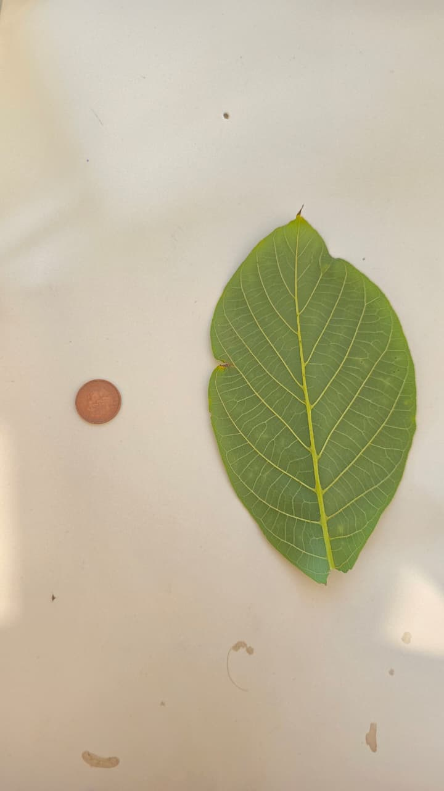

# Image-processing-for-red-coin-and-leaf-
Analysing image processing techniques for red coin and green lead

# 🍃 Leaf Morphometric Analysis — MATLAB Image Processing

A MATLAB-based image processing pipeline for segmenting, measuring, and analysing leaves using a reference coin as a physical scale marker. Developed as coursework for **MOD002643 Image Processing** at ARU (Anglia Ruskin University), Trimester 1, 2025–26.

---

## 📸 Example Output

| Input Image | Multi-Leaf Detection Output |
|:-----------:|:---------------------------:|
|  | Annotated with leaf count, area (mm²), and GLI per leaf |

Output images from Task I show detected leaves labelled with area and Green Leaf Index (GLI) values across 25 multi-leaf test images containing 3–7 leaves each.

---

## 📁 Repository Structure

```
├── TaskC.m                  # Multiband thresholding — leaf & coin segmentation
├── TaskD.m                  # Morphological filtering — mask cleaning
├── TaskE.m                  # Normalised RGB histograms of segmented objects
├── TaskF.m                  # Boundary detection & annotation
├── TaskG.m                  # Centroid, medoid & Green Leaf Index (GLI)
├── TaskH.m                  # Morphometric measurements (length, area, perimeter)
├── TaskI.m                  # Multi-leaf analysis pipeline (25 images)
├── createMask.m             # Colour thresholder helper — leaf mask
├── createMaskcoin.m         # Colour thresholder helper — coin mask
├── createMaskMulti1.m       # Colour thresholder helper — multi-leaf images
├── cleanMasks.mat           # Saved clean binary masks from Task D
├── leaf_and_coin.jpg        # Primary input image (single leaf + coin)
├── images/                  # Folder of 25 multi-leaf input images (Task I)
│   ├── image_1.jpg
│   ├── ...
│   └── image_25.jpg
└── output_images/           # Annotated output images from Task I
```

---

## 🔬 Pipeline Overview

The workflow processes a photograph of one or more leaves placed on a plain background alongside a **copper reference coin** (known diameter in mm) to convert pixel measurements into real-world units.

### Task C — Thresholding
Segments the leaf and coin from the background using **multiband colour thresholding** (via MATLAB's Color Thresholder App). Produces binary masks for each object and an entry-wise product (union mask × original image).

### Task D — Morphological Filtering
Cleans the raw binary masks using:
- `imfill` — closes interior holes
- `imopen` / `imclose` — removes noise and smooths boundaries
- `bwareaopen` — eliminates small fragments

A disk-shaped structuring element (`strel('disk', 5)`) is used. Cleaned masks are saved to `cleanMasks.mat`.

### Task E — RGB Histograms
Loads clean masks and extracts per-object pixel values to plot **normalised RGB histograms** (R, G, B channels separately) for the leaf and coin, restricted to masked pixels only.

### Task F — Boundary Detection & Annotation
Traces object outlines using morphological gradient operators and overlays a **coloured boundary** on the original image for both the leaf and coin.

### Task G — Centroid, Medoid & GLI
Computes and displays:
- **Centroid** — mean pixel position of each object
- **Medoid** — pixel closest to the centroid within the mask
- **Green Leaf Index (GLI)** — spectral greenness metric:

$$\text{GLI} = \frac{2G - R - B}{2G + R + B}$$

calculated as the mean over all leaf pixels.

### Task H — Morphometric Measurements
Using the coin diameter (mm) as a pixel-to-mm scale factor, calculates and annotates:
- Leaf **length** along longest and shortest dimensions (with orthogonal lines)
- Leaf **area** in mm²
- Leaf **perimeter** in mm (from Task F boundary)

### Task I — Multi-Leaf Analysis
Extends the single-leaf pipeline to process **25 images** each containing 4–5 leaves of different species. Key steps:

1. **Colour thresholding** to detect all green regions
2. **Hough Circle Transform** (`imfindcircles`) to detect and remove the coin
3. **Connected component labelling** (`bwlabel`) to count and isolate individual leaves
4. **Per-leaf measurement** — area (mm²), perimeter (mm), GLI
5. **Ranking** — sorts leaves by area and GLI
6. **Cropping** — saves individual leaf crops as PNG files
7. **Annotation** — overlays leaf ID, area, and GLI on the output image using `labeloverlay`
8. **Results table** — aggregates all metrics across all 25 images into a single MATLAB table

---

## 🚀 Getting Started

### Requirements

- MATLAB R2021a or later
- Image Processing Toolbox
- Computer Vision Toolbox (for `imfindcircles`)

### Running the Single-Leaf Pipeline

Run tasks in order, as each builds on outputs from the previous:

```matlab
run('TaskC.m')   % Generates BW_leaf, BW_coin, and displays masks
run('TaskD.m')   % Cleans masks; saves cleanMasks.mat
run('TaskE.m')   % Plots RGB histograms
run('TaskF.m')   % Draws object boundaries
run('TaskG.m')   % Displays centroid, medoid, GLI
run('TaskH.m')   % Annotates measurements in mm
```

### Running the Multi-Leaf Analysis

Ensure all input images are placed in an `images/` folder alongside `TaskI.m`, then:

```matlab
run('TaskI.m')
```

The script iterates over all images, prints detection results to the console, saves annotated outputs, and accumulates a results table (`results`) in the workspace.

---

## 📊 Sample Results (Task I)

| Image | Leaves Detected | Max Area (mm²) | GLI Range |
|-------|:--------------:|:--------------:|:---------:|
| image_1.jpg | 4 | 12,700 | 0.16–0.31 |
| image_10.jpg | 5 | 11,655 | 0.16–0.24 |
| image_16.jpg | 6 | 11,950 | 0.10–0.26 |
| image_18.jpg | 7 | 8,005 | 0.15–0.27 |
| image_2.jpg | 3 | 3,496 | 0.15–0.16 |

---

## ⚙️ Design Notes & Limitations

- **Hough Transform for coin removal** was adopted (on tutor recommendation) to robustly handle multi-species images where leaves overlap with coin colour ranges. Detection degrades when the coin is partially shadowed or blurred.
- **Colour thresholding** was tuned manually using the MATLAB Color Thresholder App. Values are image-specific and may need adjustment for different lighting conditions.
- Performance could be improved with adaptive circle search ranges, controlled lighting conditions, or fiducial markers.

---

## 🧰 Helper Functions

| Function | Purpose |
|----------|---------|
| `createMask.m` | Returns binary mask for the leaf in the single-leaf image |
| `createMaskcoin.m` | Returns binary mask for the coin |
| `createMaskMulti1.m` | Returns combined green mask for multi-leaf images |

These were generated via MATLAB's **Color Thresholder App** and manually refined.

---

## 📜 Academic Declaration

All MATLAB code, threshold values, and experimental decisions were written and controlled independently. OpenAI ChatGPT was used solely for **debugging assistance** and MATLAB syntax clarification — not for generating solutions. All images were photographed personally using a physical leaf and coin on a plain background. This project complies with ARU academic integrity requirements.

---

## 📄 License

This project is submitted as academic coursework and is shared for reference and learning purposes only. Do not submit any part of this code as your own academic work.
